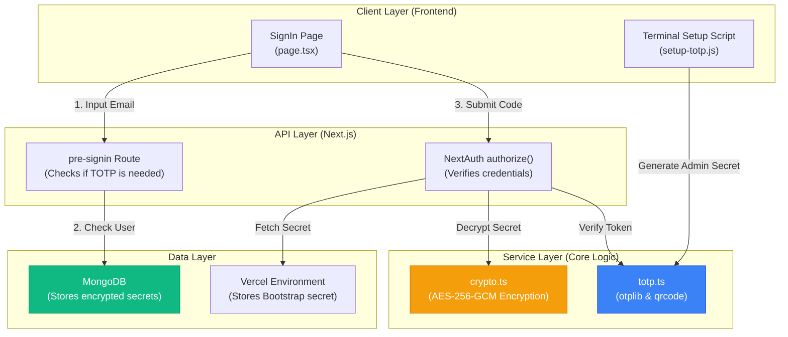
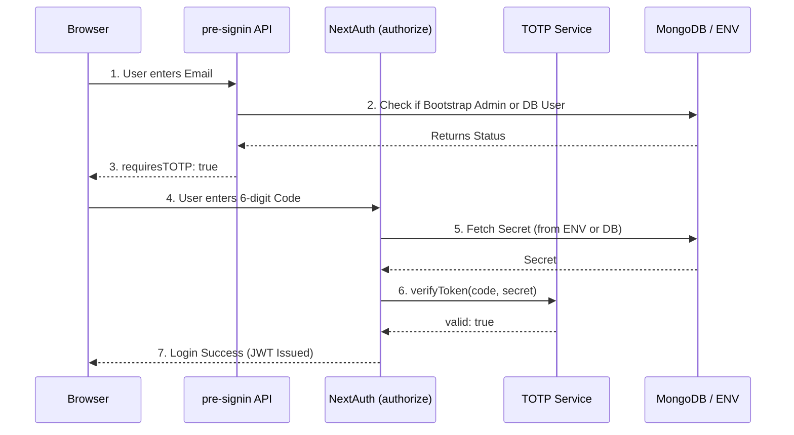

# Passwordless TOTP Authentication System

This document outlines the complete system design, architectural decisions, and step-by-step code connections for the passwordless TOTP (Time-based One-Time Password) authentication system implemented in this repository.

---

## 1. Why TOTP? (Decisions & Alternatives)

Before implementing TOTP, we evaluated several authentication strategies for the admin gateway. We needed a system that was **secure, cost-effective, and low-latency**.

### Why Opt for TOTP?
1. **Zero Latency:** Unlike Email or SMS, TOTP codes are generated entirely offline on the user's phone. There is no waiting for an email to arrive.
2. **Zero Cost:** No need to pay for SMTP servers (Resend, SendGrid) or SMS gateways (Twilio).
3. **Phishing Resistance:** Time-based codes expire every 30 seconds, making them significantly harder to steal and reuse compared to static passwords.
4. **No Third-Party Reliance:** If your email provider goes down, you can still log into your system.

### Alternatives Considered
| Strategy | Why it was rejected / Not chosen |
|----------|----------------------------------|
| **Email OTP (Previous System)** | Relies on SMTP delivery. Emails can be delayed, blocked by spam filters, or rate-limited. |
| **SMS OTP** | Expensive to scale. Vulnerable to SIM-swapping attacks. |
| **Passwords** | Vulnerable to brute-force, dictionary attacks, and database leaks. Users often reuse them. |
| **WebAuthn / Passkeys** | Highly secure, but requires complex browser API implementation and device-specific key management. TOTP was chosen as the perfect middle-ground of high security and straightforward implementation. |

---

## 2. System Architecture (Visuals)

The architecture separates concerns into distinct layers: Client, API, Service, and Data.



---

## 3. Code Connection: Start to Finish

How does the code actually execute when a user tries to log in? Here is the exact lifecycle of the authentication flow.

### Phase A: The Setup (The Bootstrap Admin Catch-22)
Because this system has no passwords, the initial admin has no way to log in to see a QR code. We solve this using a CLI script.

1. **`scripts/setup-totp.js`**: You run this locally. It calls `otplib` to generate a secure Base32 secret.
2. It prints a QR code to your terminal.
3. You scan it with Google Authenticator.
4. You manually save that secret into your `.env` file and Vercel Environment Variables as `TOTP_SECRET`.

### Phase B: The Login Flow



### Step-by-Step Code Walkthrough

#### 1. Checking the Email (`src/app/api/auth/pre-signin/route.ts`)
When the user types their email and hits "Continue", the system must determine *where* to look for their secret.
- If the email matches `ADMIN_EMAIL`, it flags them as the **Bootstrap Admin**.
- If not, it checks the database.
- It returns `{ requiresTOTP: true }` to tell the UI to ask for the 6-digit code.

#### 2. Submitting the Code (`src/lib/auth.ts`)
The user types the 6-digit code from their phone. NextAuth's `authorize` callback takes over.

```typescript
// Inside src/lib/auth.ts
let secret: string;

if (isBootstrap) {
  // Bootstrap Admin: Secret is read directly from memory (Vercel)
  secret = process.env.TOTP_SECRET;
} else {
  // Database User: Fetch the encrypted secret from MongoDB
  const dbUser = await User.findOne({ email }).select('+totpSecret');
  secret = decryptSecret(dbUser.totpSecret); // Uses crypto.ts to decrypt
}
```

#### 3. Decrypting Data at Rest (`src/lib/crypto.ts`)
If a hacker steals your database, they could steal the TOTP secrets and generate codes themselves. To prevent this, `totpSecret` in MongoDB is encrypted using **AES-256-GCM**.
- We use `NEXTAUTH_SECRET` as the master key to lock and unlock the secrets.
- `decryptSecret()` converts the encrypted string back into the raw Base32 secret so it can be verified.

#### 4. The Verification Engine (`src/lib/totp.ts`)
Finally, we pass the raw secret and the 6-digit code to `verifyToken`.

```typescript
import { OTP } from 'otplib';
const otp = new OTP();

export async function verifyToken(token: string, secret: string): Promise<boolean> {
  try {
    // otplib does the complex math to check if the time-based token matches the secret
    const result = await otp.verify({ token, secret });
    return result.valid;
  } catch (error) {
    return false; // Fail-secure: If anything breaks, deny access.
  }
}
```

If `result.valid` is true, NextAuth issues a JWT session, and the user is securely logged in!
