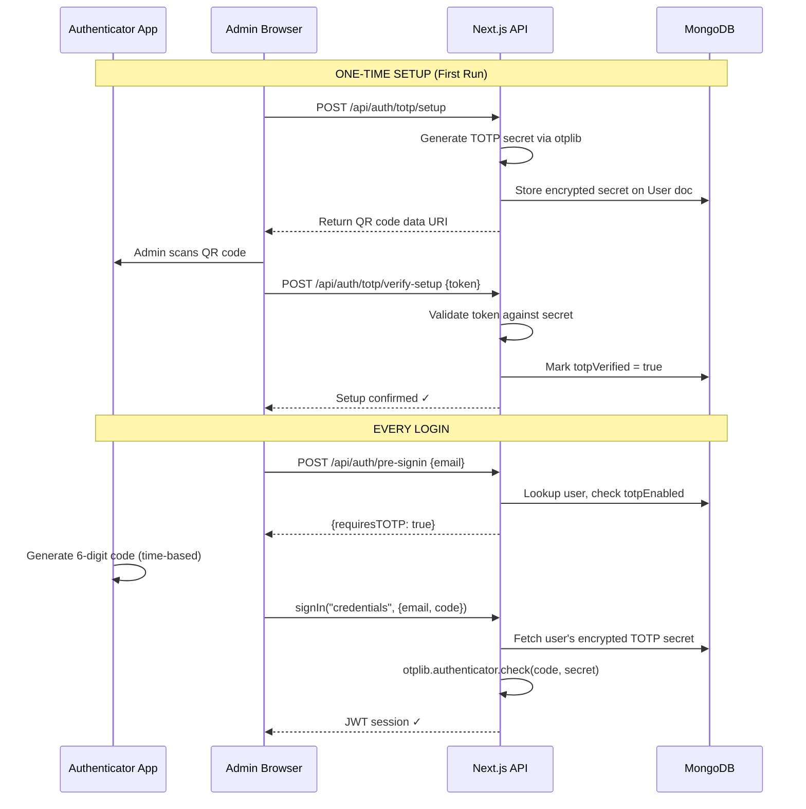
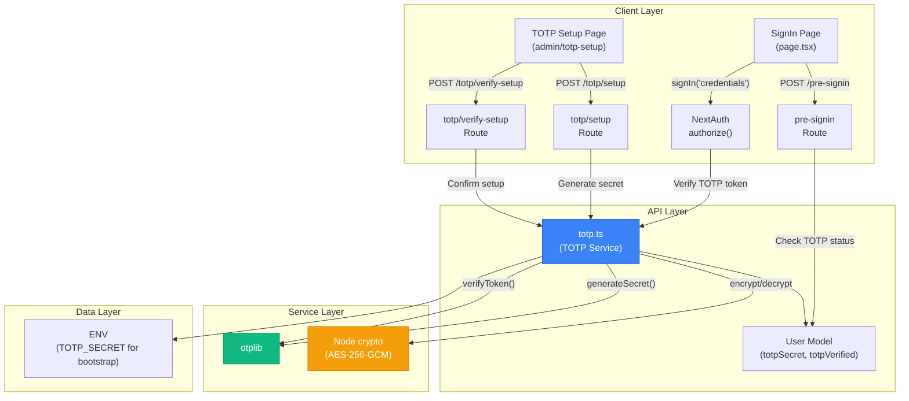

# Building a Production-Grade TOTP Authentication System

This guide explains the "Why" and "How" behind the Time-based One-Time Password (TOTP) system we built. As a beginner, you can use this as a blueprint to confidently implement Two-Factor Authentication (2FA) or passwordless TOTP in any future Node.js/Next.js project.

---

## 1. System Design Overview

When building a TOTP system, you want to ensure **Separation of Concerns**. This makes your code scalable, maintainable, and highly secure. Our architecture is split into three distinct layers:

1. **Cryptography Layer (`src/lib/crypto.ts`)**: Handles the raw mathematical encryption of secrets. It doesn't know what TOTP is; it just knows how to securely lock and unlock strings.
2. **TOTP Service Layer (`src/lib/totp.ts`)**: The "brain" of the authenticator. It handles generating secrets, creating QR codes, and verifying 6-digit codes.
3. **Authentication Layer (`src/lib/auth.ts`)**: The NextAuth configuration that ties the database, the user session, and the TOTP service together.

### The Passwordless "Catch-22"
Normally, users log in with a password and *then* set up their Authenticator app. Because this system is entirely **passwordless**, a user has no way to prove who they are before seeing the QR code. To solve this securely, we use a **Bootstrap Admin** approach:
- The initial admin sets up their Authenticator via a secure CLI terminal script.
- The secret is saved directly into the server's `.env` variables.
- Future database users will have their QR codes generated by the admin or through a secure invite link.

---

## 2. The Cryptography Layer (`crypto.ts`)

### The "Why"
When an Authenticator app generates a 6-digit code, it uses a **Base32 Secret Key** (e.g., `JBSWY3DP...`). If a hacker steals your MongoDB database, they could steal everyone's secret keys and generate valid 6-digit codes themselves.

To prevent this, we **Encrypt Data at Rest**. We use `AES-256-GCM`, an industry-standard encryption algorithm, to scramble the secret before saving it to MongoDB.

### The "How"
We use Node's built-in `crypto` library. We take the `NEXTAUTH_SECRET` from your `.env` file and use it as the master lock.

```typescript
// src/lib/crypto.ts
import { createCipheriv, createDecipheriv, randomBytes, createHash } from 'crypto';

// 1. We derive a strict 256-bit key from your NEXTAUTH_SECRET using SHA-256
function deriveKey(): Buffer {
  const secret = process.env.NEXTAUTH_SECRET;
  return createHash('sha256').update(secret).digest();
}

// 2. Encrypt the TOTP Secret before putting it in the database
export function encrypt(text: string): string {
  const key = deriveKey();
  const iv = randomBytes(16); // A random initialization vector for randomness
  const cipher = createCipheriv('aes-256-gcm', key, iv);
  
  let encrypted = cipher.update(text, 'utf8', 'hex');
  encrypted += cipher.final('hex');
  const authTag = cipher.getAuthTag().toString('hex'); // Prevents tampering
  
  // Return the combined locked string
  return `${iv.toString('hex')}:${authTag}:${encrypted}`;
}
```

---

## 3. The TOTP Service Layer (`totp.ts`)

### Packages Used
1. **`otplib`**: The core engine. It implements the mathematical RFC 6238 standard used by Google Authenticator and Authy.
2. **`qrcode`**: Translates the standard `otpauth://` URI into a visual QR code image that phone cameras can read.

### The "Why"
We abstract `otplib` and `qrcode` into a single file so that the rest of our application doesn't have to worry about configuring algorithms, time-windows, or Base32 encoding.

### The "How"
```typescript
// src/lib/totp.ts
import { OTP } from 'otplib';
import QRCode from 'qrcode';

// Create a configured instance of the OTP generator
const otp = new OTP();

export function generateSecret(accountName: string) {
  // 1. Generate the random Base32 string (the "Secret")
  const secret = otp.generateSecret();

  // 2. Generate the strict URI format that Authenticator apps expect
  const otpauthUri = otp.generateURI({
    issuer: 'Portfolio Admin',
    label: accountName,
    secret,
  });

  return { secret, otpauthUri };
}

// 3. Verify a user's 6-digit code against their stored secret
export async function verifyToken(token: string, secret: string): Promise<boolean> {
  try {
    const result = await otp.verify({ token, secret });
    return result.valid;
  } catch (error) {
    // If anything fails (e.g., malformed token), safely reject the login
    return false; 
  }
}
```

---

## 4. Connecting it to NextAuth (`auth.ts`)

### The "Why"
When the user clicks "Continue" on the login screen, Next.js calls the `authorize` callback. Here, we must securely fetch the user, figure out if they are the Bootstrap Admin or a DB User, decrypt their secret, and verify their 6-digit code.

### The "How"
```typescript
// src/lib/auth.ts
async authorize(credentials) {
  let secret: string;
  let isBootstrap = credentials.email === process.env.ADMIN_EMAIL;

  if (isBootstrap) {
    // BOOTSTRAP ADMIN: Load plaintext secret directly from .env
    secret = process.env.TOTP_SECRET;
  } else {
    // DATABASE USER: Load encrypted secret from DB and unlock it
    const dbUser = await User.findOne({ email: credentials.email }).select('+totpSecret');
    secret = decrypt(dbUser.totpSecret);
  }

  // PASS TO SERVICE LAYER: Verify the 6-digit code using otplib
  const isValid = await verifyToken(credentials.code, secret);
  
  if (!isValid) {
    throw new Error('Invalid authenticator code');
  }

  // Log the user in!
  return userObject;
}
```

## Summary Checklist for Applying to Future Projects
- [x] **Secure Storage**: Never store TOTP secrets in plaintext in the database. Always use `crypto` to encrypt them.
- [x] **Separation of Concerns**: Keep `otplib` logic in a dedicated file so you can easily swap it out or update it if standards change.
- [x] **Fail-Secure Verification**: Wrap your verification logic in `try/catch` blocks so unexpected inputs reject the login rather than crashing the server.
- [x] **Graceful Fallbacks**: Remember that TOTP requires an initial setup phase. If passwordless, ensure there is a secure way (like a CLI tool or secure email link) for the user to see the QR code for the very first time.


# Replace Email OTP with TOTP Authenticator MFA

Replace the current email-based verification code login with **TOTP (Time-based One-Time Password)** authentication — the same approach used by AWS, GitHub, and Google. This eliminates dependency on email delivery (SMTP/Resend) entirely.

## System Design Overview



## Design Patterns & Principles Applied

| Pattern | Where Applied | Why |
|---------|--------------|-----|
| **Strategy Pattern** | `sendVerificationEmail` → `verifyTOTP` swap | Verification strategy is decoupled from auth flow |
| **Repository Pattern** | User model encapsulates TOTP fields | DB access is abstracted behind Mongoose model |
| **Single Responsibility** | `src/lib/totp.ts` handles only TOTP logic | Separation of concerns — auth config doesn't contain crypto logic |
| **Defense in Depth** | Secret encrypted at rest + time-window validation | Multiple security layers |
| **Fail-Secure** | Missing/invalid TOTP always returns `null` (deny) | Never fails open |

## User Review Required

> [!IMPORTANT]
> **Bootstrap Admin TOTP Setup:** Since you use a "bootstrap admin" pattern (env-based admin without a DB record), we need to decide how to handle TOTP setup for the bootstrap admin. The plan below creates a CLI setup script that generates the secret and outputs the QR code to your terminal — you scan it once, and the secret is stored as `TOTP_SECRET` in your `.env` / Vercel env vars. This means the bootstrap admin's TOTP secret lives in the environment, while DB users' secrets live in MongoDB.

> [!IMPORTANT]
> **Backward Compatibility:** The email OTP flow (`sendVerificationEmail`, `VerificationCode` model) will be kept in the codebase but become dormant. The `pre-signin` API route will check for TOTP instead of sending emails. If you want, I can fully remove the email OTP code — let me know.

## Proposed Changes

### New Dependency

Install `otplib` (lightweight, zero-dependency TOTP library used by 2M+ projects):

```bash
npm install otplib qrcode @types/qrcode
```

---

### TOTP Service Layer (New Module)

#### [NEW] [totp.ts](file:///Users/mac/Developer/portfolio-website/src/lib/totp.ts)

A dedicated service module following **Single Responsibility Principle**:

```
src/lib/totp.ts
├── generateSecret()          → Creates a new TOTP secret + otpauth URI
├── generateQRCodeDataURI()   → Converts otpauth URI to scannable QR code
├── verifyToken()             → Validates a 6-digit token against a secret
└── encryptSecret() / decryptSecret()  → AES-256 encrypt/decrypt for DB storage
```

**Key design decisions:**
- Secrets are **AES-256-GCM encrypted** before storing in MongoDB (defense in depth)
- Uses `NEXTAUTH_SECRET` as the encryption key (already in your env, no new secrets needed)
- `verifyToken()` accepts a ±1 window (allows 30 seconds of clock drift)

---

### User Model Update

#### [MODIFY] [User.ts](file:///Users/mac/Developer/portfolio-website/src/models/User.ts)

Add TOTP fields to the User schema:

```diff
 export interface IUser extends Document {
   name: string;
   email: string;
   password?: string;
   image?: string;
   role: UserRole;
   emailVerified?: Date;
+  totpSecret?: string;      // AES-256 encrypted TOTP secret
+  totpVerified?: boolean;    // true after first successful verification
 }

 const UserSchema = new Schema<IUser>({
   ...existing fields...
+  totpSecret: { type: String, select: false },   // Never returned by default queries
+  totpVerified: { type: Boolean, default: false },
 }, { timestamps: true });
```

**Why `select: false`?** The encrypted secret is sensitive. Like `password`, it should only be fetched explicitly when needed (e.g., during auth verification), not on every `User.findOne()` call.

---

### TOTP Setup API Routes (New)

#### [NEW] [route.ts](file:///Users/mac/Developer/portfolio-website/src/app/api/auth/totp/setup/route.ts)

`POST /api/auth/totp/setup` — Generates a new TOTP secret and returns a QR code.

- **Protected:** Only callable by authenticated admin users (checks session).
- Returns: `{ qrCodeDataUri: "data:image/png;base64,..." , manualEntryKey: "JBSWY3..." }`

#### [NEW] [route.ts](file:///Users/mac/Developer/portfolio-website/src/app/api/auth/totp/verify-setup/route.ts)

`POST /api/auth/totp/verify-setup` — Confirms the user scanned the QR and can produce valid codes.

- Input: `{ token: "123456" }`
- On success: Sets `totpVerified = true` on the user document.
- This prevents locking the user out if they generate a secret but never scan it.

---

### Pre-Signin Route Update

#### [MODIFY] [route.ts](file:///Users/mac/Developer/portfolio-website/src/app/api/auth/pre-signin/route.ts)

Change the response to indicate TOTP is required instead of sending an email:

```diff
-    // Generate 6-digit code
-    const code = Math.floor(100000 + Math.random() * 900000).toString();
-    await VerificationCode.deleteMany({ email: targetEmail });
-    await VerificationCode.create({ email: targetEmail, code, createdAt: new Date() });
-
-    // Send email
-    console.log(`[AUTH] Generated Verification Code for ${targetEmail}: ${code}`);
-    try {
-      await sendVerificationEmail(targetEmail, code);
-    } catch (emailError) {
-      console.error('SMTP sending error (code is still active):', emailError);
-    }
-
-    return NextResponse.json({ success: true, requiresVerification: true, email: targetEmail });
+    // Check if TOTP is set up
+    const isTotpEnabled = isBootstrap
+      ? !!process.env.TOTP_SECRET        // Bootstrap admin: secret in env
+      : user?.totpVerified === true;      // DB users: check totpVerified flag
+
+    return NextResponse.json({
+      success: true,
+      requiresTOTP: isTotpEnabled,
+      requiresSetup: !isTotpEnabled,      // Frontend can redirect to setup page
+      email: targetEmail,
+    });
```

---

### Auth Configuration Update

#### [MODIFY] [auth.ts](file:///Users/mac/Developer/portfolio-website/src/lib/auth.ts)

Update the `authorize()` callback to verify TOTP tokens instead of checking the `VerificationCode` MongoDB collection:

```diff
-          // Find matching code in DB
-          const codeRecord = await VerificationCode.findOne({
-            email: lookupEmail,
-            code: credentials.code
-          });
-          if (!codeRecord) {
-            throw new Error('Invalid or expired verification code');
-          }
-          const isExpired = Date.now() - codeRecord.createdAt.getTime() > 10 * 60 * 1000;
-          if (isExpired) {
-            await VerificationCode.deleteOne({ _id: codeRecord._id });
-            throw new Error('Verification code has expired');
-          }
-          await VerificationCode.deleteOne({ _id: codeRecord._id });

+          // Verify TOTP token
+          let secret: string;
+          if (isBootstrap) {
+            // Bootstrap admin: secret from environment
+            secret = process.env.TOTP_SECRET || '';
+          } else {
+            // DB user: fetch encrypted secret
+            const userWithSecret = await User.findOne({ email: credentials.email }).select('+totpSecret');
+            secret = userWithSecret?.totpSecret
+              ? decryptSecret(userWithSecret.totpSecret)
+              : '';
+          }
+
+          if (!secret || !verifyToken(credentials.code, secret)) {
+            throw new Error('Invalid authenticator code');
+          }
```

---

### Sign-In Page Update

#### [MODIFY] [page.tsx](file:///Users/mac/Developer/portfolio-website/src/app/auth/signin/page.tsx)

Update the UI to reflect TOTP instead of email verification:

**Changes:**
- Replace "We sent a 6-digit verification code to..." text with "Enter the 6-digit code from your Authenticator app"
- Replace the `Mail` icon in verification step with a `Smartphone` icon from lucide-react
- Remove "Resend Code" button (TOTP codes regenerate automatically every 30s)
- Keep the "Change Email" button
- Change button text from "Send Login Code" → "Continue"
- Add link to TOTP setup page when `requiresSetup` is true

---

### TOTP Setup Page (New)

#### [NEW] [page.tsx](file:///Users/mac/Developer/portfolio-website/src/app/admin/totp-setup/page.tsx)

A protected admin page for setting up the authenticator app. Design will match the existing dark glassmorphism aesthetic of the sign-in page:

**UI Flow:**
1. Show a QR code (fetched from `/api/auth/totp/setup`)
2. Show a manual entry key below for users who can't scan
3. Input field for the user to enter a test code from their app
4. On successful verification, redirect to admin dashboard with success toast

---

### Bootstrap Admin Setup Script

#### [NEW] [setup-totp.js](file:///Users/mac/Developer/portfolio-website/scripts/setup-totp.js)

A one-time CLI script to generate the bootstrap admin's TOTP secret:

```bash
node scripts/setup-totp.js
```

Output:
```
╔══════════════════════════════════════════╗
║  TOTP Setup for Bootstrap Admin         ║
╠══════════════════════════════════════════╣
║  Scan this QR code with your app:       ║
║  [QR code displayed in terminal]        ║
║                                         ║
║  Manual entry key: JBSWY3DPEHPK3PXP    ║
║                                         ║
║  Add to your .env and Vercel:           ║
║  TOTP_SECRET=JBSWY3DPEHPK3PXP          ║
╚══════════════════════════════════════════╝
```

---

### Files Untouched (Kept for Reference)

These files become dormant but are **not deleted** (unless you request it):
- [mail.ts](file:///Users/mac/Developer/portfolio-website/src/lib/mail.ts) — Email sending utility
- [VerificationCode.ts](file:///Users/mac/Developer/portfolio-website/src/models/VerificationCode.ts) — Email OTP model

---

## Architecture Diagram (After Changes)



## Verification Plan

### Automated Tests
```bash
# 1. Build check — ensure no TypeScript errors
npm run build

# 2. Run the bootstrap TOTP setup script
node scripts/setup-totp.js
```

### Manual Verification
1. **Bootstrap Admin Flow:**
   - Run `node scripts/setup-totp.js` → scan QR with Google Authenticator
   - Add `TOTP_SECRET` to `.env`
   - Go to `/auth/signin` → enter admin email → enter authenticator code → verify login works

2. **Production (Vercel):**
   - Add `TOTP_SECRET` to Vercel environment variables
   - Redeploy
   - Test login on `sujankshrestha.com.np/auth/signin`

3. **DB User Flow (Future):**
   - Log in as admin → navigate to `/admin/totp-setup` → scan QR → confirm with test code
